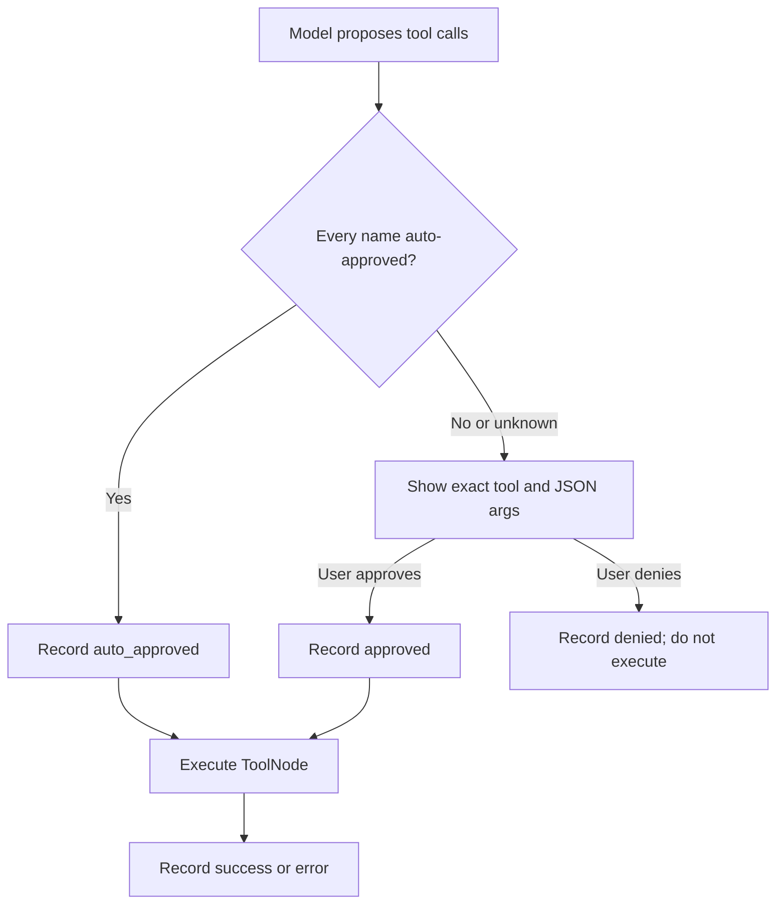

# Agent tools and approval policy

The agent uses an exact allowlist. A new, misspelled, or prompt-injected tool
name is approval-gated by default.

## Auto-approved read tools

These may run without a prompt because they read AWS or local Lighthouse state
and do not read arbitrary filesystem paths:

- Region and inventory: `tool_get_enabled_regions`,
  `tool_get_ec2_inventory`, `tool_get_rds_inventory`,
  `tool_get_s3_inventory`, `tool_get_lambda_inventory`.
- Cost and optimization: `tool_get_ri_sp_coverage`,
  `tool_get_ri_sp_recommendations`, `tool_detect_cost_anomalies`,
  `tool_get_cost_attribution`, `tool_get_compute_optimizer`,
  `tool_get_tag_cost_coverage`, `tool_get_effective_rates`,
  `tool_get_scenario_plan`, `tool_estimate_build_cost`,
  `tool_run_cost_scan`.
- Security and planning: `tool_plan_remediation`,
  `tool_get_sg_blast_radius`, `tool_check_tagging_compliance`,
  `tool_detect_overpermissive_iam`, `tool_detect_cloudwatch_gaps`,
  `tool_run_security_scan`.
- Local opportunity reads: `tool_list_opportunities`,
  `tool_get_opportunity_details`, `tool_plan_opportunities`.

Most scanner tools accept `schema_version="v1"` (compatibility data) or `"v2"`
(full `ScanResult`). The tool node normalizes the common mistaken argument name
`schema` to `schema_version` only for known schema-aware tools.

## Approval-gated tools

| Tool | Reason |
|---|---|
| `tool_read_file` | Arbitrary local path read; sensitive-path blocklist is secondary defense |
| `tool_write_file` | Local filesystem mutation |
| `parse_terraform_context` | Reads every `.tf` file in a user-selected directory |
| `tool_get_terraform_drift` | Reads and parses a user-selected Terraform directory |
| `tool_update_opportunity` | Mutates local status, owner, snooze, notes, or resolution state |
| `terminate_ec2` | Destructive AWS mutation |
| `delete_ebs` | Destructive AWS mutation |
| `s3_block_public_access` | AWS configuration mutation |

`tool_execute_bash` exists only as an internal tested helper and is intentionally
not bound to the agent tool list. Its minimal diagnostic allowlist is not a
security boundary for the model.

## Approval flow

A mixed batch containing one sensitive tool sends the entire batch to approval.
Denial routes back to the model with a synthetic rejection message.

## Interactive CLI remediation

CLI remediation is separate from the agent. It builds risk phases for display,
but phases are not approval units. The user chooses numbered actions and then
confirms each exact label, resource, and region/global scope separately before
the registered action runs.
