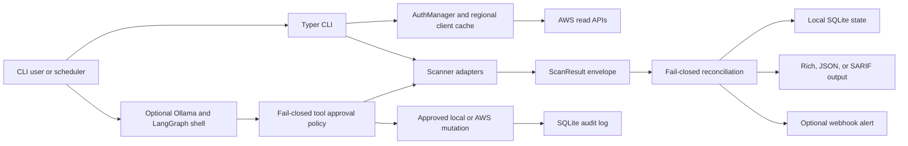

# Architecture

AWS Lighthouse has four runtime boundaries: CLI orchestration, scanner adapters,
local state/reconciliation, and the optional LangGraph agent.

## Module boundaries

| Module | Responsibility |
|---|---|
| `cli.py` | Typer entry points, user interaction, dashboard assembly |
| `scan_orchestrator.py` | Bounded concurrent fan-out with deterministic merge order |
| `tools/` | AWS service adapters and remediation primitives |
| `scan_contract.py` | `ScanResult` envelopes, error normalization, list merging |
| `reconciliation.py` | Deltas, persistable baselines, per-source collection errors |
| `opportunities.py` | Finding mapping, coverage, lifecycle reconciliation |
| `db_schema.py` | SQLite DDL and additive migrations |
| `db.py` | State repositories and transaction behavior |
| `output_rendering.py` | Shared formatting and SARIF machine output |
| `agent_policy.py` | Exact auto-approved tool allowlist; unknown tools fail closed |
| `ollama_runtime.py` | Ollama endpoint and required-model health validation |
| `remediation_executor.py` | Validation and execution of one approved remediation |
| `agent.py` | Ollama health, LangGraph tools, approval node, audit integration |
| `live_qualification.py` | Sandbox identity and opt-in guards for live tests |

## Analyze flow

1. Authenticate once and cache clients by `(service, region)` with adaptive AWS
   retries.
2. Discover enabled regions unless `--region` is explicit; then apply policy
   include/exclude filters.
3. Run regional scanners with at most five workers. Global checks run once.
4. Preserve every scanner result as `{ok, data, errors}`. Expected unavailable
   services remain explicit degraded evidence.
5. Build v1 and v2 payloads. V1 is compatibility data; v2 preserves envelopes.
6. Compare against the last snapshot with the identical account/scope/config.
7. Persist a new baseline. Clean sections replace prior data. Degraded list
   sections union prior and newly observed evidence; degraded mappings retain
   the prior mapping. This prevents absence caused by failure from becoming a
   resolution.
8. Reconcile opportunities only within successfully scanned source/region
   coverage. A regional error excludes only that region; a global error excludes
   the global source scope.
9. Render output and optionally alert on new HIGH/CRITICAL findings.

## Identity and scope

Snapshots are keyed by AWS account plus a scope string. Scope includes single
versus multi-region mode, cost-history days, and a hash of non-default policy
settings. A baseline from a different policy cannot silently resolve findings.

Regional resource identity is `(region, resource ID)`. This matters for security
groups because IDs are not globally unique. Global S3 and IAM findings use a
global scope.

## Concurrency and failure model

`ThreadPoolExecutor.map` preserves input order even when network calls complete
out of order. Scanner adapters must translate expected AWS failures into
`ScanResult.errors`; unexpected programming exceptions propagate and fail the
cycle. Partial data remains available, but completeness-dependent operations
(resolution and coverage) fail closed.

## Mutation model

The normal `analyze` and all `watch` cycles are read-only. Interactive CLI
remediation first presents a plan, lets the user choose actions, validates the
action/region, and asks for a separate confirmation for each exact resource.
The agent routes all non-allowlisted tools through its approval node and records
the decision and execution result.
